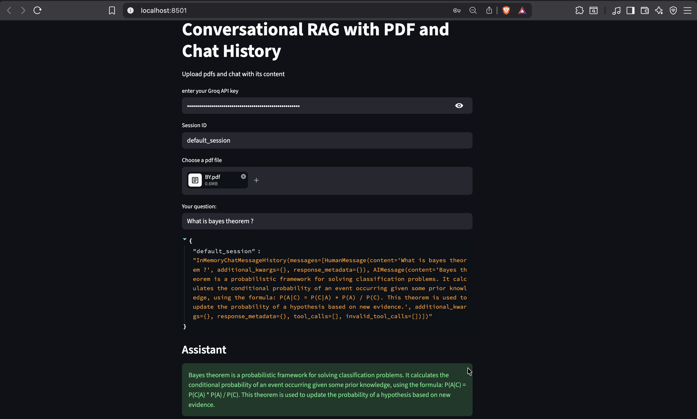
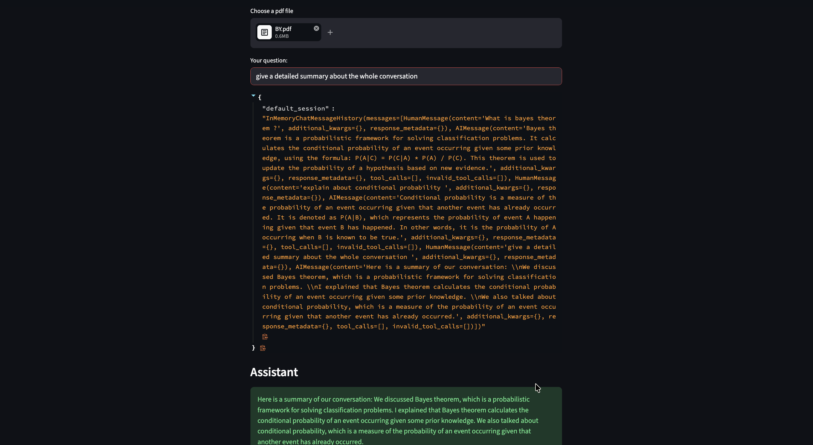

# Conversational RAG Chatbot with PDF & Chat History

A Conversational RAG (Retrieval-Augmented Generation) application built using Streamlit, LangChain, FAISS, and Groq LLMs.

This project allows users to upload PDF files and ask questions about their content while maintaining conversational memory using chat history.

---

## Features

- Upload and chat with multiple PDF documents
- Conversational memory with session-based chat history
- Retrieval-Augmented Generation (RAG)
- History-aware retriever using LangChain
- Fast semantic search using FAISS
- Groq LLM integration (`llama-3.3-70b-versatile`)
- Streamlit interactive UI
- HuggingFace embeddings support

---

## Tech Stack

- Python
- Streamlit
- LangChain
- FAISS
- Groq API
- HuggingFace Embeddings
- PyPDFLoader

---

## Project Architecture

```text
PDF Upload
    ↓
Document Loading
    ↓
Text Splitting
    ↓
Embeddings Generation
    ↓
FAISS Vector Store
    ↓
History Aware Retriever
    ↓
RAG Chain
    ↓
Conversational Question Answering
```

---

## Installation

### 1. Clone Repository

```bash
git clone https://github.com/charrann12/RAG-QnA-PDFupload-Conversational.git
```

---

### 2. Create Virtual Environment

```bash
python3.10 -m venv venv
```

Activate virtual environment:

#### Mac/Linux

```bash
source venv/bin/activate
```

#### Windows

```bash
venv\Scripts\activate
```

---

### 3. Install Dependencies

```bash
pip install -r requirements.txt
```

---


## Environment Variables

Groq API key is entered directly in the Streamlit UI.

---

## Run the Application

```bash
streamlit run app.py
```

---

## How It Works

1. User uploads PDF documents
2. PDFs are split into smaller chunks
3. Embeddings are generated using HuggingFace models
4. FAISS stores vector embeddings
5. User questions are converted into standalone queries using chat history
6. Relevant chunks are retrieved
7. Groq LLM generates contextual answers

---


## Streamlit Chat Interface

### First query


### Summary of the conversation

---
